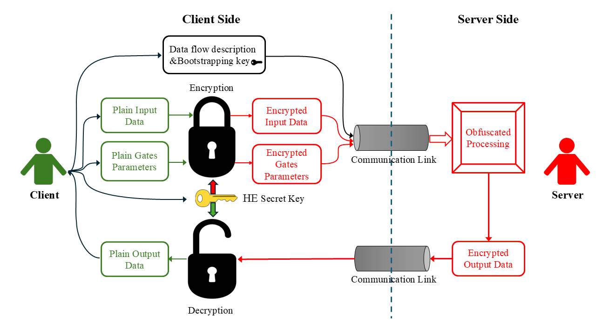

# OHLG (Oblivious Homomorphic Logic Gates)
## Overview
This repo provides an unoptimized prototype for the Oblivious Homomorphic Logic Gates scheme [1]. The system allows executing an obfuscated circuit on encrypted data, and producing encrypted output. So it basically hides the inputs, the process, and the output from the operator server who does the processing. The system is visualized in the figure below.

The system consists of two parties, the client and the server:  
* **Client**: The client is the owner of the data and the circuit, but with low computing and storage power. It encrypts the data to be processed, encrypts the gates' parameters, serializes the data flow description, and sends them along with the HE bootstrapping key to the server side. The client then decrypts the evaluation results sent back from the server.
* **Server**: The server, which has more computing power, executes the circuit, built with obfuscated gates according to the data flow description, on the encrypted data using the encrypted gates' parameters and sends the encrypted results to the client.

##Repo structure
There are two main directories:
1. **ohlg**: A rust crate that contains the implementation of the oblivious logic gates and an oblivious matching application.
2. **tfhe-rs**: A modified-APi version of the TFHE implementation by Zama. The original TFHE by Zama can be found [here](https://github.com/zama-ai/tfhe-rs "Zama TFHE-rs")

## How to use  
The software prototype can be either compiled from source or launched through a docker image.

### Build from source
The code was tested on Ubuntu 24.04.01 LTS and Windows 11
#### General steps
1. Make sure to have Rust and Cargo installed in your system [https://doc.rust-lang.org/cargo/getting-started/installation.html]
2. Clone the repo
```
git clone https://github.com/Carleton-SCI/OHLG.git
```
3. Change directory to ohlg
```
cd OHLG/ohlg
```


#### Gate benchmarking
The benchmarking of a single gate performance is implemented in the main binary file ```main.rs```, which can be run through:
```
cargo run --bin ohlg --release
```
The benchmarking tests an obfuscated "NAND" operation with both inputs are zeros. The additive parameter is 3/8 and the multiplicative parameter is 1. You can change these parameters to implement other gates by changing the following values in ```main.rs```
```Rust
//----Perform an Obfuscated logic operation (NAND) between two ciphertexts----
    //m1 and m2 are the Boolean plaintext values to be encrypted
    //M is the plaintext value of the multiplicative parameter (=1 for NAND operation)
    //d is the plaintext value of the additive parameter (=3/8 for NAND operation)
    
    let m1:bool = false;
    let m2:bool = false;
    let M:u32 = 1;
    let d: u32 = (1 << (32-3))*3 ;
    let opr_str = "NAND";
```
The implementation also allows for choosing the TFHE-io parameters ([link](https://tfhe.github.io/tfhe/security_and_params.html)) or the default Boolean TFHE-rs parameters ([link](https://github.com/zama-ai/tfhe-rs)). You can choose between them by editing the value of the ```param_choice``` variable in ```main.rs``` to be ```TFHE_RS``` or ```TFHE_IO```
```Rust
let param_choice = "TFHE_RS";
```

#### Integer Benchmarking
The repo also includes benchmarks for `tfhe::shortint` and `tfhe::integer` (Radix) bitwise AND operations.

**Shortint Benchmark**
This binary benchmarks `tfhe::shortint` bitwise AND operations across different parameter sets (1_1, 2_2, 3_3, 4_4).

To run it:
```
cargo run --bin shortint --release
```
Sample results:
```
+--------+--------------+-------------+----------------+--------+
| Config | Message bits | Carry bits  |    Avg AND     | Result |
+--------+--------------+-------------+----------------+--------+
|  1_1   |      1       |      1      |       13.69 ms |   1    |
|  2_2   |      2       |      2      |       19.93 ms |   2    |
|  3_3   |      3       |      3      |      152.20 ms |   4    |
|  4_4   |      4       |      4      |     1090.90 ms |   8    |
+--------+--------------+-------------+----------------+--------+
```
The `shortint` is the basic building block of the integer framework in TFHE-rs. We are investigating the performance of the 4 main configurations, named after the size of the ciphertext as `message_carry` bits. For example, a 2_2 configuration indicates that the ciphertext has an initial space for 2-bit message and after homomorphic operations it has a space for additional 2-bit carry. If a bitwise operation between two n-bit variables must be done in one operation (i.e. one bootstrapping process), n_n configuration must be used. Although the result does not have a carry, but the internal evaluation methodology uses the full carry's n bits to construct the rotation polynomial.

From the results, it can be seen that in most cases evaluating a bitwise operation between two 3-bit variables (160 ms) is slower compared to evaluating the operation is three 1-bit operations (3 * 14 = 42 ms ) between the two variables. This is because increasing the capacity of the ciphertext requires a significant increase in the underlying TLWE ciphertext and the rotation polynomial/Look up table of the Bootstrapping step. We should stress that while this speed comparison is valid for bitwise operations, it may be not the same for integer arithmetic operations. This is because an n-bit arithmetic (like n-bit multiplication) typically require m 1-bit gates where n>>m. In this case, using the n-bit encoding will be faster.


**Longint Benchmark**
This binary benchmarks `tfhe::integer` (Radix) bitwise AND operations. It tests both sequential and parallel execution modes across different block sizes and parameter sets.
To run it:
```
cargo run --bin longint --release
```
Sample results:
```
Summary (8 samples per cell)
+-------------------+--------+-----------+----------------+-------------+-------------+-------------+-------------+
| Param (Msg_Carry) | Blocks | Threaded  | Total Msg bits |   Avg AND   |   Plain A   |   Plain B   |  Decrypted  |
+-------------------+--------+-----------+----------------+-------------+-------------+-------------+-------------+
|        1_1        |   1    |    no     |       1        |     14.11ms |      0x0001 |      0x0001 |      0x0001 |
|        1_1        |   2    |    no     |       2        |     27.71ms |      0x0001 |      0x0003 |      0x0001 |
|        1_1        |   3    |    no     |       3        |     41.43ms |      0x0005 |      0x0003 |      0x0001 |
|        1_1        |   4    |    no     |       4        |     56.03ms |      0x0005 |      0x0003 |      0x0001 |
+-------------------+--------+-----------+----------------+-------------+-------------+-------------+-------------+
|        1_1        |   1    |    yes    |       1        |     13.87ms |      0x0001 |      0x0001 |      0x0001 |
|        1_1        |   2    |    yes    |       2        |     15.28ms |      0x0001 |      0x0003 |      0x0001 |
|        1_1        |   3    |    yes    |       3        |     14.39ms |      0x0005 |      0x0003 |      0x0001 |
|        1_1        |   4    |    yes    |       4        |     14.62ms |      0x0005 |      0x0003 |      0x0001 |
+-------------------+--------+-----------+----------------+-------------+-------------+-------------+-------------+
+-------------------+--------+-----------+----------------+-------------+-------------+-------------+-------------+
|        2_2        |   1    |    no     |       2        |     19.62ms |      0x0001 |      0x0003 |      0x0001 |
|        2_2        |   2    |    no     |       4        |     39.96ms |      0x0005 |      0x0003 |      0x0001 |
|        2_2        |   3    |    no     |       6        |     59.38ms |      0x0015 |      0x0033 |      0x0011 |
|        2_2        |   4    |    no     |       8        |     79.01ms |      0x0055 |      0x0033 |      0x0011 |
+-------------------+--------+-----------+----------------+-------------+-------------+-------------+-------------+
|        2_2        |   1    |    yes    |       2        |     19.44ms |      0x0001 |      0x0003 |      0x0001 |
|        2_2        |   2    |    yes    |       4        |     20.43ms |      0x0005 |      0x0003 |      0x0001 |
|        2_2        |   3    |    yes    |       6        |     22.17ms |      0x0015 |      0x0033 |      0x0011 |
|        2_2        |   4    |    yes    |       8        |     21.88ms |      0x0055 |      0x0033 |      0x0011 |
+-------------------+--------+-----------+----------------+-------------+-------------+-------------+-------------+
+-------------------+--------+-----------+----------------+-------------+-------------+-------------+-------------+
|        3_3        |   1    |    no     |       3        |    150.61ms |      0x0005 |      0x0003 |      0x0001 |
|        3_3        |   2    |    no     |       6        |    302.58ms |      0x0015 |      0x0033 |      0x0011 |
|        3_3        |   3    |    no     |       9        |    452.37ms |      0x0055 |      0x0033 |      0x0011 |
|        3_3        |   4    |    no     |       12       |    602.46ms |      0x0A55 |      0x0C33 |      0x0811 |
+-------------------+--------+-----------+----------------+-------------+-------------+-------------+-------------+
|        3_3        |   1    |    yes    |       3        |    149.48ms |      0x0005 |      0x0003 |      0x0001 |
|        3_3        |   2    |    yes    |       6        |    158.34ms |      0x0015 |      0x0033 |      0x0011 |
|        3_3        |   3    |    yes    |       9        |    159.47ms |      0x0055 |      0x0033 |      0x0011 |
|        3_3        |   4    |    yes    |       12       |    161.34ms |      0x0A55 |      0x0C33 |      0x0811 |
+-------------------+--------+-----------+----------------+-------------+-------------+-------------+-------------+
+-------------------+--------+-----------+----------------+-------------+-------------+-------------+-------------+
|        4_4        |   1    |    no     |       4        |       1.10s |      0x0005 |      0x0003 |      0x0001 |
|        4_4        |   2    |    no     |       8        |       2.22s |      0x0055 |      0x0033 |      0x0011 |
|        4_4        |   3    |    no     |       12       |       3.05s |      0x0A55 |      0x0C33 |      0x0811 |
|        4_4        |   4    |    no     |       16       |       4.08s |      0xAA55 |      0xCC33 |      0x8811 |
+-------------------+--------+-----------+----------------+-------------+-------------+-------------+-------------+
|        4_4        |   1    |    yes    |       4        |       1.04s |      0x0005 |      0x0003 |      0x0001 |
|        4_4        |   2    |    yes    |       8        |       1.19s |      0x0055 |      0x0033 |      0x0011 |
|        4_4        |   3    |    yes    |       12       |       1.17s |      0x0A55 |      0x0C33 |      0x0811 |
|        4_4        |   4    |    yes    |       16       |       1.25s |      0xAA55 |      0xCC33 |      0x8811 |
+-------------------+--------+-----------+----------------+-------------+-------------+-------------+-------------+
```
The `longint` or simply `integer` is the main crate in TFHE-rs. Its implementation consists fundamentally of blocks of `shortint` where each core block contains a segment of the ciphertext. The higher API covers these details from the user, but an interested user can use the radix interface to fine-tune the block size and number of blocks of the ciphertext. It should be also noted that, by default, the `shortint` blocks of an `integer` are processed independently on different threads. A few important notes to be taken from the results above:  
1- The effect of threading is significant and it makes the processing of different blocks happen at the same time.
+-------------------+--------+-----------+----------------+-------------+-------------+-------------+-------------+
| Param (Msg_Carry) | Blocks | Threaded  | Total Msg bits |   Avg AND   |   Plain A   |   Plain B   |  Decrypted 
+-------------------+--------+-----------+----------------+-------------+-------------+-------------+-------------+
|        1_1        |   1    |    no     |       1        |     14.10ms |      0x0001 |      0x0001 |      0x0001 |
|        1_1        |   4    |    no     |       4        |     56.26ms |      0x0005 |      0x0003 |      0x0001 |
|        1_1        |   4    |    yes    |       4        |     14.60ms |      0x0005 |      0x0003 |      0x0001 |  

2- An `integer` variable with 1 block takes the same time as the core `shortint`, and the threading has no effec in this case  
+-------------------+--------+-----------+----------------+-------------+-------------+-------------+-------------+
| Param (Msg_Carry) | Blocks | Threaded  | Total Msg bits |   Avg AND   |   Plain A   |   Plain B   |  Decrypted 
+-------------------+--------+-----------+----------------+-------------+-------------+-------------+-------------+
|        3_3        |   1    |    no     |       3        |    154.17ms |      0x0005 |      0x0003 |      0x0001 |
|        3_3        |   1    |    yes    |       3        |    153.90ms |      0x0005 |      0x0003 |      0x0001 |  

3- Again, executing n 1-bit bitwise operations (either threaded or not) is faster than executing 1 n-bit operation  
+-------------------+--------+-----------+----------------+-------------+-------------+-------------+-------------+
| Param (Msg_Carry) | Blocks | Threaded  | Total Msg bits |   Avg AND   |   Plain A   |   Plain B   |  Decrypted 
+-------------------+--------+-----------+----------------+-------------+-------------+-------------+-------------+
|        1_1        |   3    |    no     |       3        |     42.23ms |      0x0005 |      0x0003 |      0x0001 |
|        1_1        |   3    |    yes    |       3        |     14.36ms |      0x0005 |      0x0003 |      0x0001 |
|        3_3        |   1    |    no     |       3        |    154.17ms |      0x0005 |      0x0003 |      0x0001 |
|        3_3        |   1    |    yes    |       3        |    153.90ms |      0x0005 |      0x0003 |      0x0001 |  


#### ODM (Oblivious Direct Matching) Application
The application works as follows:
1. **Client**
   * Prepare and serialize the data flow description of the matching circuit.
   * Encrypt the parameters of the gates.
   * Encrypt the query data, if it is not already stored on the server.
   * Send the serialized data flow description, encrypted gate parameters, encrypted query data, and the bootstrapping key to the server.
2. **Server**
   * Execute the matching circuit, as defined by the received data flow description and using the encrypted gate parameters, on the encrypted query data and the encrypted search corpus.
   * Return the encrypted result to the client.
3. **Client**
   * Decrypt the result to interpret the matching outcome.

To run the experiment, first execute:
```
cargo run --bin client_odm --release
```
This creates and serializes the keys, the search character ciphertext, the search corpus ciphertext, and the encrypted gate parameters. The code asks the user to enter the search character should be encrypted and sent to the server. The code also contains a sample search corpus of "ABCDEFGHIJ" which can be changed in ```ohlg/bin/client_odm.rs```
```Rust
let plain_search_corpus = "ABCDEFGHIJ";
```
Changing the length of the search corpus (originally 10 bytes) is not tested.  

The second step is to run the server process by:
```
cargo run --bin server_odm --release
```
which does the obfuscated processing. **Note** that reading the encrypted gate parameters might take a while because the data serialization technique (save and read from disk) is not optimized, this is just a prototype.

The third step is to run the verification process, which is typically at the client side, by:
```
cargo run --bin verif_odm --release
```
which decrypts and prints the matching result.


### Using the docker image
The repo contains ```ohlg_bin``` which is a pre-built docker image for the executables. First, clone the repo and change directory:
```
git clone https://github.com/Carleton-SCI/OHLG.git
cd OHLG/ohlg
```
The following command can be used to load the image (be sure the system has docker installed first):
```
docker load -i ohlg_bin.tar
```
A docker container can be created and run to test the executables through
```
docker run -it --rm ohlg_bin
```
There are 6 executables that can be tested. To benchmark the obfuscated NAND gate:
```
./ohlg
```
To benchmark shortint and longint operations (Please note it may take few miutes up to 10~15 for longint):
```
./shortint
./longint
```
For the ODM application, first use:
```
./client_odm
```
which asks the user to enter the search character to be encrypted. Then
```
./server_odm
./verif_odm
```
sequentially to execute the matching process and decrypt the result.
For a user interested in modifying rust scripts (```main.rs``` can be modified to test other gates for example), the ```Dockerfile``` is also provided. Modify the rust code as required, then use the docker file to create a new image:
```
docker build -t new_image_name .
```
The new image can be loaded and used following similar steps as above.

# Licensing
BSD 3-Clause Clear License
Copyright (c) 2025 Secure Cryptographic Implementations lab (SCI-lab), Carleton University.  
This software is built in and on top of Zama's TFHE implementation, for which the license is retained in the thfe-rs directory as is.


# References
[1] Mahmoud Abdelhafeez Sayed and Mostafa Taha, Oblivious Homomorphic Logic Gates, IEEE Transactions on Dependable and Secure Computing, 2025
